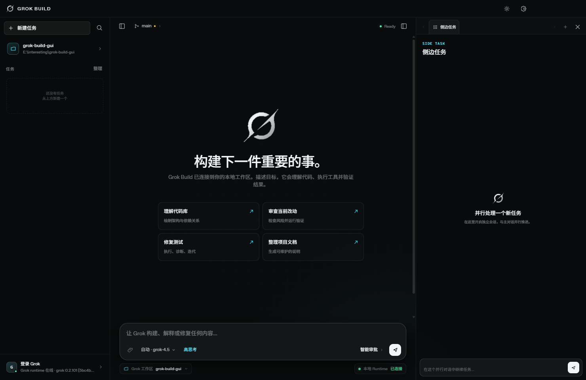
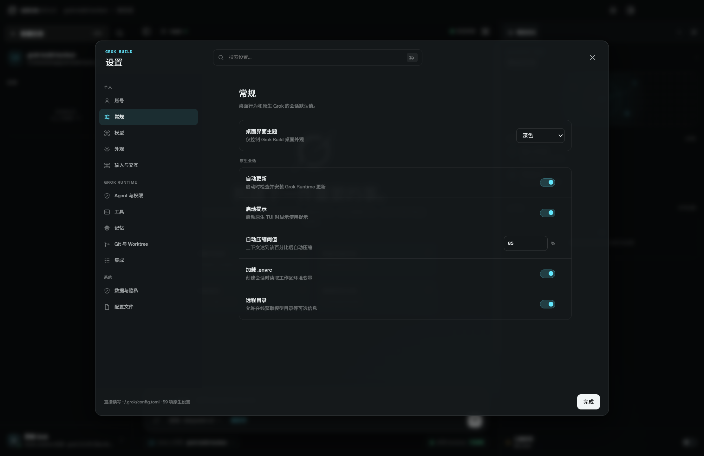
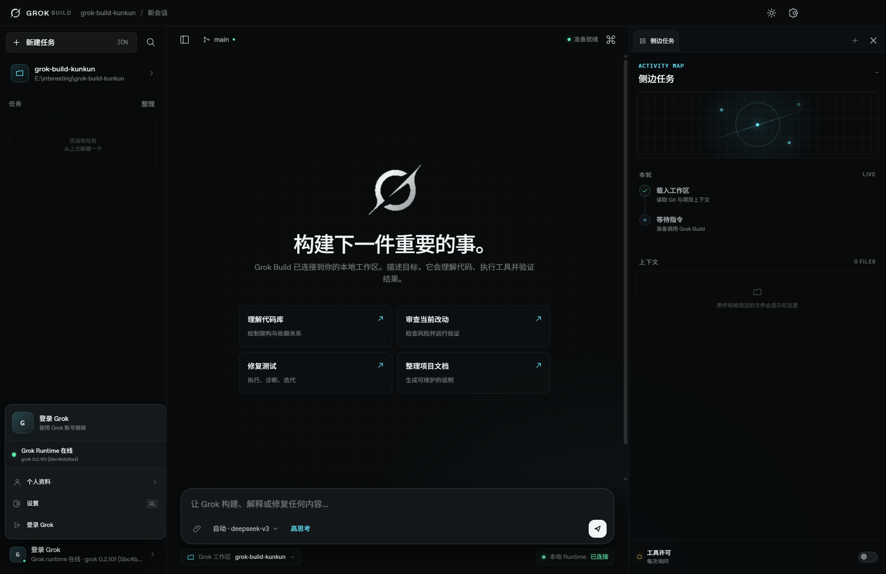
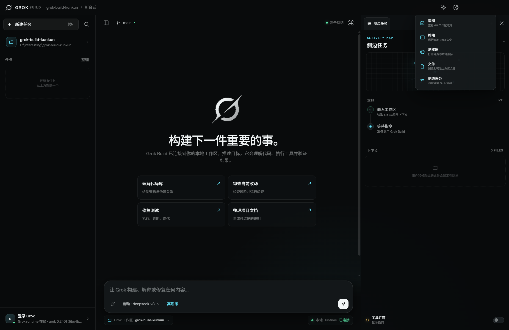
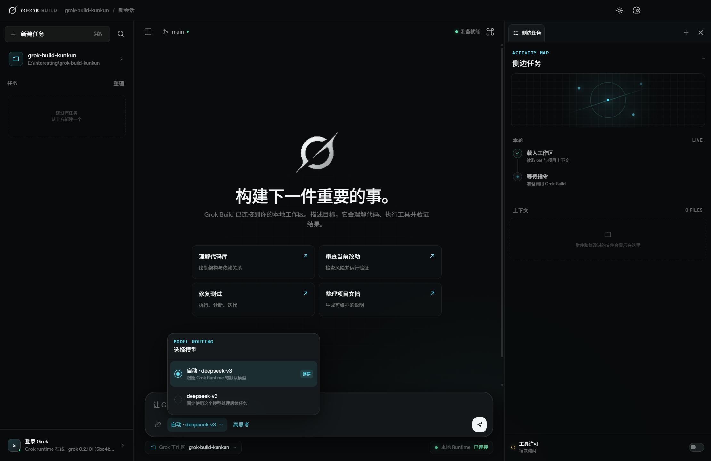
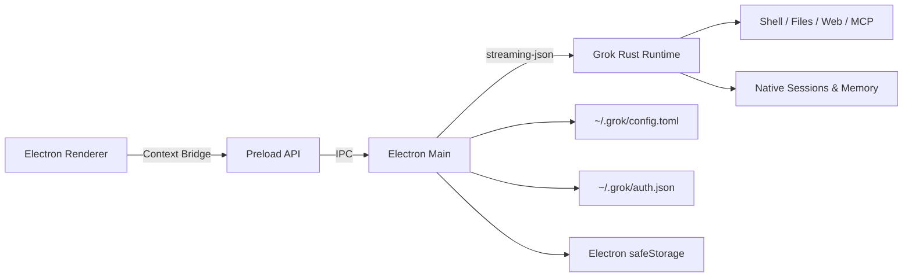

<div align="center">


# Grok Build GUI

**为 Grok Build 原生 TUI Runtime 打造的桌面 AI 编程工作区**

稳定流式对话 · 原生配置中心 · Grok 账号登录 · 第三方模型发现 · 多标签开发工作台

[](#快速开始)
[](desktop/)
[](crates/codegen/xai-grok-pager/)
[](#第三方模型)
[](#第三方模型)
[](LICENSE)

[快速开始](#快速开始) · [功能总览](#功能总览) · [原生设置中心](#原生设置中心) · [第三方模型](#第三方模型) · [右侧工作台](#右侧多标签工作台) · [开发与验证](#开发与验证)



</div>

---

## 项目简介

Grok Build GUI 是 Grok Build 原生 Rust CLI/TUI 的桌面入口。桌面端通过 `streaming-json` 接入现有 Agent Runtime，继续使用原生模型、工具、权限、MCP、Skills、Plugins、Hooks、Memory、Worktree 与认证系统，同时提供更适合桌面开发的可视化交互。

它不是一套与 TUI 分离的 Agent 实现：

- 对话由原生 `grok` Runtime 执行；
- 多轮会话通过原生 `sessionId` 续接；
- 设置直接读写 `~/.grok/config.toml`；
- 账号信息来自原生 `~/.grok/auth.json`；
- OAuth 登录和退出分别调用 `grok login --oauth` 与 `grok logout`；
- 第三方模型会生成原生 `[model.*]` 配置并进入同一模型目录。

> 当前桌面端以 Windows 为主要验证平台；Electron Builder 中同时保留 macOS 与 Linux 打包配置。

---

## 功能总览

| 模块 | 已实现能力 |
|---|---|
| **对话工作区** | 稳定流式输出、多轮会话、Markdown/代码块、附件、任务历史、停止生成、滚动跟随 |
| **模型与思考** | 模型弹出选择器、思考档位选择器、Runtime 模型目录、第三方模型合并 |
| **原生设置** | 59 项类型化设置、全局搜索、分区导航、原始 TOML 编辑、自动备份 |
| **第三方模型** | OpenAI / Anthropic 自动识别、模型发现、按需勾选、本机密钥保护 |
| **右侧工作台** | 审阅、终端、浏览器、文件、侧边任务，多标签并行使用 |
| **Grok 账号** | OAuth 登录、退出登录、个人资料、团队信息、Runtime 状态与版本 |
| **本地工作区** | 目录选择、Git 状态、Diff 统计、文件浏览与预览、本地 Shell |
| **Grok 视觉系统** | 来自原生 TUI Braille 标志、暗色宇宙底、Signal Cyan、统一浮层与动效 |

---

## 界面预览

<table>
  <tr>
    <td width="50%">
      <strong>原生设置中心</strong><br><br>
      
    </td>
    <td width="50%">
      <strong>账号与 Runtime 菜单</strong><br><br>
      
    </td>
  </tr>
  <tr>
    <td width="50%">
      <strong>右侧多标签工作台</strong><br><br>
      
    </td>
    <td width="50%">
      <strong>模型选择器</strong><br><br>
      
    </td>
  </tr>
</table>

---

## 快速开始

### 环境要求

- Node.js 20+
- npm
- Git
- Grok Build Runtime

检查 Runtime：

```powershell
grok --version
grok models
```

### 启动桌面端

```powershell
git clone https://github.com/Jane-o-O-o-O/grok-build-GUI.git
cd grok-build-GUI/desktop
npm install
npm start
```

桌面端按以下顺序查找 Runtime：

1. `GROK_BINARY`
2. 仓库内 `target/release/xai-grok-pager.exe`
3. 仓库内 `target/debug/xai-grok-pager.exe`
4. `~/.grok/bin/grok.exe`
5. 系统 `PATH` 中的 `grok`

如需指定 Runtime：

```powershell
$env:GROK_BINARY = "C:\path\to\grok.exe"
npm start
```

### 打包

```powershell
cd desktop
npm run pack
```

Windows 解包产物：

```text
desktop/dist/win-unpacked/Grok Build.exe
```

完整安装包配置：

```powershell
npm run dist
```

---

## 对话与任务工作区

### 稳定流式输出

桌面端消费 Runtime 的 `streaming-json` 事件，将高频文本更新合并到 `requestAnimationFrame` 渲染周期，避免对话区域在流式生成时反复重排和闪烁。

支持：

- 文本增量输出
- Thinking/Reasoning 状态
- 工具调用状态
- Runtime 诊断信息
- 会话完成与错误状态
- 生成中止
- 自动滚动与“回到底部”按钮

### Composer

- `Enter` 发送
- `Shift + Enter` 换行
- 文件附件
- 模型弹出选择器
- 思考档位弹出选择器
- 自动批准开关
- 本地工作区状态
- Runtime 在线状态

模型和思考按钮均采用显式菜单，点击后选择目标项，不再通过单击循环切换。

### 多轮会话

每个桌面任务保存：

- 标题
- 工作目录
- 创建/更新时间
- 消息历史
- 原生 `sessionId`

后续消息通过 `--resume SESSION_ID` 继续原生会话。

---

## 原生设置中心

设置界面参考桌面 Codex 的信息架构，提供左侧分组导航、顶部搜索、设置卡片和完整配置文件编辑器。

桌面设置直接读写：

```text
~/.grok/config.toml
```

### 设置分区

#### 个人

- 账号
- 常规
- 模型
- 外观
- 输入与交互

#### Grok Runtime

- Agent 与权限
- 工具
- 记忆
- Git 与 Worktree
- 集成

#### 系统

- 数据与隐私
- 配置文件

### 59 项类型化原生设置

<details>
<summary><strong>常规与模型</strong></summary>

- 默认模型
- Web Search 模型
- Runtime 自动更新
- 启动提示
- 自动压缩阈值
- `.envrc` 加载
- 远程模型目录

</details>

<details>
<summary><strong>外观</strong></summary>

- TUI Theme
- 系统深色/浅色主题映射
- Compact Mode
- Fullscreen / Minimal Mode
- 时间戳
- Thinking Blocks
- Tool Call Grouping
- Collapsed Edit Blocks
- Thoughts Width
- Mermaid Rendering
- Display Refresh Cadence

</details>

<details>
<summary><strong>输入、语音与滚动</strong></summary>

- Readline / Vim 输入
- Vim Scrollback Navigation
- Prompt Suggestions
- Voice Capture Mode
- Grok STT 语言目录
- Scroll Speed / Mode / Lines
- Invert Scroll
- Text Selection
- 六项 Contextual Hints

</details>

<details>
<summary><strong>Agent、工具与权限</strong></summary>

- Permission Mode
- Remember Tool Approvals
- Default Selected Permission
- Ask User Question Timeout
- Subagents
- Two-pass Compaction
- Fork Secondary Model
- 子 Agent 取消策略
- Respect Gitignore
- Bash Timeout / Output Limit
- LSP Tools
- Codebase Indexing

</details>

<details>
<summary><strong>记忆、Worktree 与隐私</strong></summary>

- Memory Enabled
- Save on End
- Memory Watcher
- Search Max Results / Min Score
- Initial Memory Injection
- New Session Worktree Mode
- Fork Worktree Mode
- Hunk Tracker Mode
- Telemetry
- Feedback

</details>

### 配置写入保护

类型化设置更新时会：

1. 重新读取当前 TOML；
2. 只更新目标 section/key；
3. 保留注释、第三方模型和其他未知配置；
4. 使用临时文件完成原子替换；
5. 生成备份：

```text
~/.grok/config.toml.desktop-backup
```

“配置文件”页面还提供完整 TOML 编辑器，用于 MCP、Plugins、Skills、Hooks、Agents、Sandbox、Permission Rules 和企业认证等开放式配置。

---

## 第三方模型

设置 → 模型中可以添加第三方服务：

1. 输入 API URL；
2. 输入 API Key；
3. 点击“发现模型”；
4. 桌面端自动尝试 OpenAI 与 Anthropic 协议；
5. 勾选需要的模型；
6. 保存后模型进入 Composer 模型选择器。

### 支持的协议

| 协议 | 模型发现 | 推理后端 |
|---|---|---|
| OpenAI Compatible | `GET /v1/models` | `chat_completions` |
| Anthropic Messages | `GET /v1/models` + `x-api-key` | `messages` |

保存后会生成原生配置：

```toml
[model."desktop-provider-model"]
model = "REMOTE_MODEL_ID"
base_url = "https://api.example.com/v1"
env_key = "GROK_DESKTOP_KEY_PROVIDER_ID"
api_backend = "chat_completions"
```

密钥处理：

- 密钥不写入 `config.toml`；
- 密钥不进入 Renderer Local Storage；
- Windows 使用 Electron `safeStorage` 保护；
- 启动 Runtime 时通过环境变量注入。

---

## 右侧多标签工作台

右侧区域采用浏览器式标签页。点击 `+` 可以同时打开多个功能：

### 审阅

- `git status --short`
- Diff 统计
- 变更文件列表
- 点击文件跳转到文件预览

### 终端

- 在当前工作区执行本地命令
- 展示 stdout / stderr / exit code
- Windows PowerShell UTF-8 输出
- 输出大小与执行时间限制

### 浏览器

- 内嵌 WebView
- 支持网页和 localhost 服务
- Sandbox / Context Isolation
- 系统浏览器打开

### 文件

- 工作区文件浏览
- 文件内容预览
- 排除 `.git`、`node_modules`、`target`、`dist`
- 路径边界校验
- 二进制和大文件检查

### 侧边任务

- Activity Map
- 当前任务时间线
- 上下文文件
- 工具许可状态

---

## Grok 账号与 Runtime

点击左下角账号区域会打开统一菜单：

- Grok 登录身份
- 邮箱、团队和角色
- Runtime 在线状态
- Runtime 版本
- 个人资料
- 设置
- 登录 / 退出

登录调用：

```text
grok login --oauth
```

退出调用：

```text
grok logout
```

账号资料读取自原生 `~/.grok/auth.json`。Renderer 只接收脱敏后的姓名、邮箱、团队和登录方式，Token、Refresh Token 与 API Key 不会进入页面状态。

---

## 架构



### 安全边界

- Renderer 开启 `contextIsolation`
- Renderer Sandbox 开启
- Renderer 无 Node.js 注入
- 仅通过白名单 IPC 调用本地能力
- WebView 禁用 Node Integration
- 文件读取限制在当前工作区
- 文件预览限制大小并过滤二进制
- 第三方密钥由主进程管理

---

## 开发与验证

```powershell
cd desktop
npm install
npm run verify
npm run test:providers
npm run test:config
npm run test:account
```

测试覆盖：

- Renderer 与 IPC 静态连线
- OpenAI / Anthropic 模型发现
- 鉴权 Header
- 原生模型配置生成
- 密钥不落盘验证
- 59 项原生配置读写
- TOML 目标字段更新与保留
- 配置备份
- 账号资料脱敏

只预览界面：

```powershell
npm run preview
# http://127.0.0.1:4174
```

### 构建原生 TUI

```bash
cargo check -p xai-grok-pager-bin
cargo run -p xai-grok-pager-bin
cargo build -p xai-grok-pager-bin --release
```

---

## 仓库结构

| 路径 | 内容 |
|---|---|
| `desktop/` | Electron 桌面应用 |
| `desktop/renderer/` | UI、样式、Composer、设置与工作台 |
| `desktop/main.cjs` | Runtime、配置、账号、文件、终端 IPC |
| `desktop/native-config.cjs` | 原生 TOML 类型化读写 |
| `desktop/provider-config.cjs` | 第三方协议识别与模型配置 |
| `desktop/account-info.cjs` | 原生账号资料脱敏 |
| `desktop/docs/` | 设计说明、审计和界面截图 |
| `crates/codegen/xai-grok-pager` | 原生 TUI、渲染、输入和设置 |
| `crates/codegen/xai-grok-shell` | Agent Runtime、配置、认证和会话 |
| `crates/codegen/xai-grok-tools` | Shell、文件、搜索等工具实现 |
| `crates/codegen/xai-grok-workspace` | 工作区、版本控制、执行与检查点 |

---

## 原生 TUI 文档

完整用户指南位于：

```text
crates/codegen/xai-grok-pager/docs/user-guide/
```

包括认证、快捷键、Slash Commands、配置、主题、MCP、Skills、Plugins、Hooks、Memory、Headless、ACP、Subagents、Sandbox、Plan Mode、后台任务与使用量监控。

---

## 项目维护者

- [Jane-o-O-o-O](https://github.com/Jane-o-O-o-O) — AI Application Engineer / Agent Developer

## License

第一方代码使用 [Apache License 2.0](LICENSE)。第三方与移植代码继续遵循各自许可证，详情见：

- [THIRD-PARTY-NOTICES](THIRD-PARTY-NOTICES)
- [Grok Tools Third Party Notices](crates/codegen/xai-grok-tools/THIRD_PARTY_NOTICES.md)
- [third_party/NOTICE](third_party/NOTICE)

Grok、xAI 及相关标识归其各自权利方所有。本项目桌面界面建立在仓库内开放的 Grok Build Runtime/TUI 源码之上。
