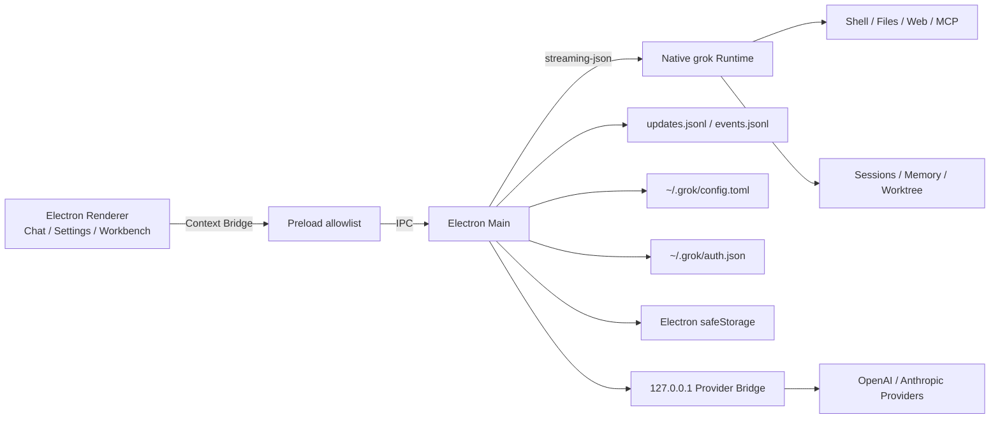

<div align="center">

**English | [简体中文](README.zh-CN.md)**


# Grok Build GUI

**An open-source desktop AI coding workspace powered by the native Grok Build runtime**

Stable streaming · Native tool execution · Third-party models · Parallel sessions · 59 native settings · English and Chinese

[](https://github.com/Jane-o-O-o-O/grok-build-gui/releases/latest)
[](https://github.com/Jane-o-O-o-O/grok-build-gui/actions/workflows/release-desktop.yml)
[](#download)
[](#download)
[](#download)
[](desktop/)
[](#english-and-chinese-ui--grok-visual-system)
[](LICENSE)

[Download v0.1.0](https://github.com/Jane-o-O-o-O/grok-build-gui/releases/tag/v0.1.0) ·
[Quick Start](#quick-start) ·
[Feature Map](#feature-map) ·
[Third-Party Models](#third-party-models-and-tool-compatibility-bridge) ·
[Development](#development-and-verification)


</div>

---

## What This Project Is

**Grok Build GUI** is a community desktop interface for the native `grok` / Grok Build CLI and TUI runtime. It provides a visual Electron workspace while continuing to use the runtime's original models, sessions, memory, tools, permissions, MCP servers, Skills, Plugins, Hooks, Subagents, and Worktrees.

It is not a second Agent implementation separated from the CLI, and it is not a web chat page wrapped in Electron:

- Every task is executed by the local `grok` runtime.
- The desktop app consumes real-time output through `--output-format streaming-json`.
- Follow-up turns continue the native session through `sessionId` and `--resume`.
- Tool activity is synchronized from the native session's `updates.jsonl` and `events.jsonl` files.
- Settings are read from and written directly to `~/.grok/config.toml`.
- Account state comes from `~/.grok/auth.json`, while OAuth is delegated to `grok login --oauth`.
- Third-party models are written into native `[model.*]` configuration and used by the same runtime.

In one sentence: **Grok Build GUI keeps the native execution engine and gives it a desktop workflow for interaction, parallel tasks, model management, and local development tools.**

---

## Highlights

1. **Native runtime instead of a rewritten Agent**

   CLI, TUI, and GUI share the same sessions, Memory, tools, permissions, and advanced integrations, reducing behavioral drift between separate implementations.

2. **The full tool execution process is visible**

   The interface shows more than a final answer. Thinking, Shell, file operations, search, web access, edits, permission events, and lifecycle transitions appear in their real execution order.

3. **Third-party models can do more than chat**

   OpenAI-compatible and Anthropic models are discovered automatically, probed for Tool Calling, and normalized through a local compatibility bridge when their protocol differs from what the runtime expects.

4. **Parallel development in one window**

   Run the main Agent alongside multiple independent side Agents, persistent terminals, and embedded browsers, all within the same project workspace.

5. **Native settings without constant manual TOML editing**

   The settings center exposes 59 typed settings, global search, protected writes, and automatic backups while preserving a full TOML editor for advanced configuration.

6. **Local-first data and credential boundaries**

   Runtime execution, files, Git, and terminal sessions stay local. Account data is redacted before reaching the Renderer, and Provider secrets never enter Renderer storage or native TOML.

7. **A desktop experience designed specifically for Grok Build**

   The app includes English and Chinese interfaces, resizable three-column layout, a Braille-derived Grok mark, Signal Cyan accents, and compact information density for long-running development work.

8. **Release packages for all three desktop platforms**

   One Git tag tests and builds six Windows, macOS, and Linux artifacts and publishes a SHA-256 checksum manifest.

---

## Current Release

Latest public release: **v0.1.0 — First Public Preview**

| Capability | v0.1.0 |
|---|---|
| Native `grok` runtime integration | ✅ |
| Streaming text, Thinking, and tool lifecycle | ✅ |
| Native session continuation | ✅ |
| Tool permission policy selection | ✅ |
| Third-party model discovery and tool probing | ✅ |
| OpenAI / Anthropic tool compatibility bridge | ✅ |
| 65-command Slash picker | ✅ |
| 59 native Grok settings | ✅ |
| Instant English / Chinese switching | ✅ |
| Multiple terminals, browsers, and side Agents | ✅ |
| Git state, branch creation, and switching | ✅ |
| Windows Setup / Portable ZIP | ✅ |
| macOS Intel / Apple Silicon DMG | ✅, unsigned preview builds |
| Linux AppImage / DEB | ✅ |
| Automated builds and SHA-256 verification | ✅ |

> The desktop package does not currently bundle the Grok runtime. Install the native `grok` CLI first, or point `GROK_BINARY` to a local runtime binary.

---

## Interface Gallery

<table>
  <tr>
    <td width="50%"><strong>Native tool execution and parallel side task</strong><br><br></td>
    <td width="50%"><strong>65-command Slash picker</strong><br><br></td>
  </tr>
  <tr>
    <td width="50%"><strong>Third-party models and tool capability</strong><br><br></td>
    <td width="50%"><strong>Native runtime model picker</strong><br><br></td>
  </tr>
  <tr>
    <td width="50%"><strong>Multi-tab persistent terminals</strong><br><br></td>
    <td width="50%"><strong>File tree and read-only preview</strong><br><br></td>
  </tr>
  <tr>
    <td width="50%"><strong>Embedded browser and local services</strong><br><br></td>
    <td width="50%"><strong>Git branch and workspace status</strong><br><br></td>
  </tr>
  <tr>
    <td width="50%"><strong>59 native settings</strong><br><br></td>
    <td width="50%"><strong>Instant English / Chinese switching</strong><br><br></td>
  </tr>
  <tr>
    <td width="50%"><strong>Account and runtime status</strong><br><br></td>
    <td width="50%"><strong>Workbench feature picker</strong><br><br></td>
  </tr>
</table>

---

## Download

All packages are built from the same `v0.1.0` tag through GitHub Actions. The release also includes `SHA256SUMS.txt`.

| Platform | Download | Notes |
|---|---|---|
| Windows x64 | [Setup.exe](https://github.com/Jane-o-O-o-O/grok-build-gui/releases/download/v0.1.0/Grok-Build-Desktop-0.1.0-Windows-x64-Setup.exe) | Standard installer |
| Windows x64 | [Portable.zip](https://github.com/Jane-o-O-o-O/grok-build-gui/releases/download/v0.1.0/Grok-Build-Desktop-0.1.0-Windows-x64-Portable.zip) | Extract and run `Grok Build.exe` |
| macOS Apple Silicon | [arm64.dmg](https://github.com/Jane-o-O-o-O/grok-build-gui/releases/download/v0.1.0/Grok-Build-Desktop-0.1.0-macOS-arm64.dmg) | M-series Macs, unsigned preview |
| macOS Intel | [x64.dmg](https://github.com/Jane-o-O-o-O/grok-build-gui/releases/download/v0.1.0/Grok-Build-Desktop-0.1.0-macOS-x64.dmg) | Intel Macs, unsigned preview |
| Linux x64 | [AppImage](https://github.com/Jane-o-O-o-O/grok-build-gui/releases/download/v0.1.0/Grok-Build-Desktop-0.1.0-Linux-x86_64.AppImage) | Portable Linux app |
| Debian / Ubuntu x64 | [DEB](https://github.com/Jane-o-O-o-O/grok-build-gui/releases/download/v0.1.0/Grok-Build-Desktop-0.1.0-Linux-amd64.deb) | System package |
| Checksums | [SHA256SUMS.txt](https://github.com/Jane-o-O-o-O/grok-build-gui/releases/download/v0.1.0/SHA256SUMS.txt) | SHA-256 for all six packages |

Full release page: <https://github.com/Jane-o-O-o-O/grok-build-gui/releases/tag/v0.1.0>

### Linux AppImage

```bash
chmod +x Grok-Build-Desktop-0.1.0-Linux-x86_64.AppImage
./Grok-Build-Desktop-0.1.0-Linux-x86_64.AppImage
```

### macOS Preview Note

The v0.1.0 DMGs are built automatically but are not yet signed or notarized with an Apple Developer identity. macOS may show a developer verification prompt on first launch. In Finder, right-click the app and choose **Open**.

---

## Quick Start

### 1. Verify the Grok Runtime

```powershell
grok --version
grok models
```

### 2. Run the Desktop App

Use a package from the release above, or run from source:

```powershell
git clone https://github.com/Jane-o-O-o-O/grok-build-gui.git
cd grok-build-gui/desktop
npm install
npm start
```

Development mode:

```powershell
npm run dev
```

Preview the Renderer without Electron main-process or runtime integration:

```powershell
npm run preview
# http://127.0.0.1:4174
```

### Runtime Discovery Order

The desktop app searches for the runtime in this order:

1. `GROK_BINARY` environment variable.
2. `resources/bin/grok` or `grok.exe` in a packaged application.
3. Repository `target/release/xai-grok-pager` build.
4. Repository `target/debug/xai-grok-pager` build.
5. `~/.grok/bin/grok`.
6. `grok` available in the system `PATH`.

Specify a runtime explicitly:

```powershell
$env:GROK_BINARY = "C:\path\to\grok.exe"
npm start
```

---

## Feature Map

| Area | Current implementation |
|---|---|
| **Native Agent runtime** | `streaming-json`, native sessions, new session IDs, `--resume`, model, reasoning effort, permission mode, attachment paths |
| **Streaming conversation** | Text deltas, Thinking, Markdown, code blocks, stop generation, diagnostics, scroll follow, jump to bottom |
| **Tool execution** | Tool type, input, output, state, file locations, working directory, duration, exit code, grouped consecutive steps |
| **Composer** | Model, reasoning effort, permission policy, attachments, Slash picker, Enter to send, Shift+Enter for newline |
| **Third-party models** | OpenAI / Anthropic detection, model discovery, individual and batch tool probing, local compatibility bridge |
| **Session management** | Local task history, date groups, native `sessionId`, stop and continue, multi-turn context |
| **Right workbench** | Multiple terminals, multiple browsers, file tree and read-only preview, multiple side Agents |
| **Git workspace** | Current branch, Detached HEAD, Dirty, Staged, Upstream, Ahead/Behind, create and switch |
| **Settings center** | 59 native settings, global search, section navigation, integration summary, raw TOML editor, backups |
| **Account and runtime** | OAuth login/logout, redacted profile, team and role, runtime path, version, model catalog refresh |
| **Internationalization** | Instant English / Chinese switching across the primary interface, settings, Provider, account, and workbench |
| **Network proxy** | System proxy/PAC, HTTP(S), SOCKS, shared environment for runtime/OAuth/models/terminal, localhost bypass |
| **Release engineering** | Parallel Windows/macOS/Linux builds, Draft Release creation, checksum manifest, tag-triggered workflow |

---

## Native Runtime and Sessions

### CLI Invocation

The main conversation and side tasks are translated into native CLI arguments:

```text
grok --cwd WORKSPACE -p PROMPT --output-format streaming-json
```

Depending on the selected state, the desktop app adds:

```text
--session-id SESSION_ID
--resume SESSION_ID
--model MODEL
--reasoning-effort low|medium|high
--permission-mode auto|dontAsk
--always-approve
```

The GUI and TUI therefore use the same Agent, tools, and configuration rather than maintaining two independent behavior stacks.

### Multi-Turn Sessions

Each main task stores:

- Title.
- Working directory.
- Creation and update timestamps.
- Desktop message history.
- Native `sessionId`.

The desktop app assigns a Session ID on the first turn and continues subsequent turns with `--resume SESSION_ID`. Task history is stored locally in Renderer storage. Attachments remain in the active Composer state and are not persisted as historical attachment objects.

### Attachments

The Composer accepts attachments in three ways: choose files with the paperclip button, drag files from the desktop into the conversation, or paste an image directly into the prompt with the system paste shortcut. Dragged files retain their native absolute paths; pasted PNG, JPEG, WebP, GIF, and BMP images are validated and written to the app's temporary attachment directory before being added. Duplicate paths are ignored, the list is capped at 32 attachments, and a drag overlay confirms the drop target.

At send time, the app appends attachment paths to the Prompt. The runtime then reads those files through its own tools and permission policies; the Renderer does not preload file contents into message history.

---

## Streaming, Thinking, and Tool Execution

### Stable Streaming Rendering

The desktop app consumes line-delimited runtime JSON and merges high-frequency text updates into `requestAnimationFrame` render cycles, reducing repeated layout, flicker, and scroll jitter.

Handled events include:

- Text deltas.
- Thinking / Reasoning deltas.
- Runtime diagnostics.
- Session binding.
- Tool start, update, completion, and failure.
- Permission request and resolution.
- Phase and turn lifecycle events.
- Normal completion, cancellation, and abnormal exit.

### Native Tool Activity Bridge

In addition to standard output, the app follows native session files:

```text
updates.jsonl
events.jsonl
```

This allows structured `tool_call`, `tool_call_update`, lifecycle, and permission events from the TUI/runtime to be routed into the correct desktop conversation.

### Tool Cards

Tool cards are inserted at their real execution positions and can be expanded independently. They show:

- Shell, file, search, web, and edit tool categories.
- Input arguments and a compact summary.
- Output.
- Related file locations.
- Current working directory.
- Pending / Running / Permission / Completed / Failed / Cancelled state.
- Duration.
- Exit code.

Consecutive tool calls can be grouped into an **Execution Steps** block with live progress, permission attention, and failure counts. The main conversation and side tasks share the same rendering model.

> The GUI displays native permission events and selects the CLI permission policy. Final permission decisions still belong to the runtime; the desktop app does not bypass the runtime to approve tools directly.

---

## Composer, Models, and 65 Slash Commands

The Composer provides:

- `Enter` to send.
- `Shift + Enter` for a newline.
- Local file attachments.
- Native and third-party model selection.
- Low / Medium / High reasoning effort.
- Automatic, strict, and full-access permission policies.
- Runtime and workspace status.
- Stop-generation control.
- Searchable Slash command picker.

Typing `/` opens a picker containing **65 commands**, with alias search, arrow navigation, `Enter` / `Tab` selection, and `Escape` dismissal.

Desktop-native commands such as `/new`, `/model`, `/effort`, `/settings`, `/theme`, `/login`, `/logout`, `/cd`, `/copy`, and `/tasks` are handled immediately by the interface. Other commands are inserted into the Composer and sent to the native runtime, including:

```text
/fork        /compact      /context      /hooks
/plugins     /skills       /memory       /plan
/resume      /mcps         /btw          /recap
/voice       /loop         /imagine      /usage
/tasks       /goal         /code-review  /check-work
```

---

## Third-Party Models and Tool Compatibility Bridge

Settings → Models can add OpenAI-compatible or Anthropic services to the native Grok model catalog.

### Provider Setup

1. Enter an API Base URL.
2. Enter an API Key.
3. Select **Discover models**.
4. The desktop app tries OpenAI and Anthropic protocols.
5. It retrieves the model list from `/v1/models`.
6. Probe one model or the entire Provider for tool capability.
7. Select the models to keep.
8. Saved models immediately appear in the Composer model picker.

### Protocol and Backend Detection

| Protocol | Model catalog | Tool probe | Runtime backend |
|---|---|---|---|
| OpenAI Compatible | `GET /v1/models` | Chat Completions, then Responses fallback | `chat_completions` / `responses` |
| Anthropic Messages | `GET /v1/models` with `x-api-key` | Native Messages tool call | `messages` |

Each model receives one of four capability labels:

- **Native** — returns usable tool calls directly.
- **Bridge** — requires tool-call normalization by the desktop bridge.
- **Unsupported** — no compatible tool protocol was detected.
- **Unknown** — has not been probed yet.

Batch probing shows live progress. Saved Providers can refresh their model catalog, re-run capability checks, or be removed.

### Why the Compatibility Bridge Exists

Some OpenAI-compatible services can generate tool arguments but omit the tool name, return only the legacy `function_call` shape, or do not support streaming tool deltas. The desktop app runs a tokenized local bridge bound only to `127.0.0.1` that can:

- Normalize legacy `function_call` into `tool_calls`.
- Infer a missing tool name when exactly one JSON Schema matches.
- Generate missing Tool Call IDs.
- Use a non-streaming upstream request for tool calls when needed.
- Convert the normalized result back into SSE deltas for the runtime.
- Preserve the selected OpenAI, Responses, or Anthropic backend.

Compatible third-party models can therefore enter the native Grok Agent tool loop instead of falling back to text-only chat.

### Native Model Configuration

Saving a Provider generates a desktop-managed `[model.*]` section such as:

```toml
[model."REMOTE_MODEL_ID-provider"]
model = "REMOTE_MODEL_ID"
base_url = "http://127.0.0.1:PORT/TOKEN/provider/PROVIDER_ID/v1"
env_key = "GROK_DESKTOP_KEY_PROVIDER_ID"
api_backend = "chat_completions"
stream_tool_calls = false
```

The bridge address is created dynamically at application startup. The settings UI may display Provider name, Base URL, protocol, and capability state; request forwarding and secret decryption stay in Electron's main process.

### API Key Handling

- API Keys are not written to `~/.grok/config.toml`.
- API Keys do not enter Renderer Local Storage.
- The Renderer receives only redacted state such as `hasKey` and `keyProtected`.
- Electron `safeStorage` is used when the system supports it.
- Keys are injected into the runtime through environment variables.
- The compatibility bridge listens on `127.0.0.1` and uses a random token path.

---

## Multi-Tab Workbench

The right side is a resizable, browser-style tab workbench. Terminal, browser, and side-task tabs support multiple independent instances; the Files view stays single-instance. Overflow controls scroll through long tab lists.

The left task sidebar and right workbench can both be resized. Their widths are saved in local application state.

### Persistent Terminals

- PowerShell on Windows and the login Shell on macOS/Linux.
- One independent persistent Shell process per tab.
- Initial directory equals the workspace active when the tab is created.
- `cd`, environment variables, and Shell state persist between commands.
- Live stdout and stderr.
- Command history, clear, restart, and close controls.
- Separate process, output, and history for every terminal tab.

### Embedded Browser

- Electron WebView-based.
- Supports websites and local development servers.
- Back, forward, reload, address navigation, and loading state.
- `localhost`, `127.0.0.1`, and `::1` automatically use HTTP.
- Regular domains automatically receive HTTPS.
- Independent URL and navigation state per tab.
- Open the current page in the system browser.
- Node Integration disabled, with Context Isolation and Sandbox enabled.

### File Browser and Preview

- Lazy directory tree expansion.
- Filename filtering.
- Read-only text preview.
- Breadcrumb and file tab.
- Open with the system application, reveal in file manager, copy relative/absolute path, and copy filename.
- Dependency and build directories such as `node_modules`, `target`, and `dist` are excluded.
- Main-process path boundary validation blocks reads outside the workspace.
- Binary files and previews larger than 1 MB are rejected.

### Parallel Side Tasks

- Independent messages, `sessionId`, run state, and stop control per tab.
- Same streaming text, Thinking, and tool cards as the main conversation.
- The latest ten main-thread messages are included as current context when a side task is sent.
- Uses the same workspace and native project Memory.
- Multiple side tasks can run in parallel without overwriting the main session.

---

## Git Workspace

The branch control reads real Git state:

- Current local branch.
- Short commit ID for Detached HEAD.
- Clean or dirty workspace.
- Number of uncommitted files.
- Number of staged files.
- Upstream branch.
- Ahead / Behind counts.
- Recently updated local branches.

You can search and switch local branches, or create a new branch and switch to it immediately. New branch names are validated with:

```text
git check-ref-format --branch
```

Branch creation and switching are locked while an Agent task is active, preventing the code context from changing mid-run. Git itself continues to protect operations that would overwrite local changes, and its error message is shown in the desktop UI.

---

## Native Settings Center

The settings center reads and writes:

```text
~/.grok/config.toml
```

It provides section navigation, global search, typed controls, integration summaries, and a full TOML editor.

### 59 Typed Settings

These settings map to native Grok runtime/TUI configuration. Some affect the runtime or TUI rather than the desktop Renderer itself.

| Category | Count | Representative settings |
|---|---:|---|
| General and models | 7 | Default model, Web Search model, auto update, startup tips, compaction threshold, `.envrc`, remote catalog |
| Appearance and display | 12 | TUI Theme, system theme mapping, Compact, Screen Mode, timestamps, Thinking, tool grouping, Mermaid, refresh cadence |
| Agent and permissions | 8 | Permission Mode, remember approvals, default permission, question timeout, Subagents, two-pass compaction, Fork model, cancellation policy |
| Input, voice, and scrolling | 16 | Readline/Vim, suggestions, Voice Mode/STT Language, scroll behavior, selection behavior, six contextual hints |
| Local tools | 5 | Respect Gitignore, Bash Timeout, output limit, LSP Tools, Codebase Indexing |
| Memory | 6 | Enabled, Save on End, Watcher, result count, minimum score, Initial Injection |
| Git and Worktree | 3 | New Session Worktree, Fork Worktree, Hunk Tracker |
| Data and privacy | 2 | Telemetry, Feedback |
| **Total** | **59** | Type, enum, and numeric range validation |

### Protected Configuration Writes

When changing one typed setting, the desktop app:

1. Re-reads the current TOML.
2. Updates only the requested section and key.
3. Preserves comments, unknown fields, and third-party model configuration.
4. Validates booleans, numbers, ranges, and enums.
5. Writes to a temporary file and atomically replaces the target.
6. Creates a backup:

```text
~/.grok/config.toml.desktop-backup
```

The **Config file** page keeps a full TOML editor for MCP, Plugins, Skills, Hooks, Agents, Sandbox, Permission Rules, enterprise authentication, and other open-ended settings.

### Integration Summary

The settings center reports native integration directories and configuration:

- MCP.
- Plugins.
- Skills.
- Hooks.
- Agents.
- Custom Models.

It shows discovered item counts, source, and path, and can open the corresponding configuration file or directory.

---

## Grok Account and Runtime

The account entry combines:

- Login identity.
- Email.
- Team and role.
- Login method.
- Runtime online state.
- Runtime path.
- Runtime version.
- Profile, settings, login, and logout actions.

Login delegates to:

```text
grok login --oauth
```

The native runtime opens OAuth in the system browser. The desktop UI surfaces the launch, browser-opened, completed, and error states.

Logout delegates to:

```text
grok logout
```

Profile data is read from `~/.grok/auth.json`. Only redacted fields such as display name, email, team, role, and login method enter Renderer state. Tokens, refresh tokens, and API Keys stay out of the page.

---

## Network and System Proxy

The desktop app uses Electron/Chromium to resolve operating-system proxy and PAC configuration:

- HTTP, HTTPS, SOCKS, and PAC routing.
- Shared with the native runtime, OAuth, model catalog, third-party providers, and terminal processes.
- Re-resolved before runtime detection and model requests.
- System proxy changes do not require restarting the entire app.
- Third-party Providers resolve PAC against their own Base URL rather than an xAI URL.
- Model discovery and tool probes use the Chromium Session.
- `NO_PROXY` keeps `localhost`, `127.0.0.1`, `::1`, and the local model bridge direct.

---

## English and Chinese UI / Grok Visual System

v0.1.0 includes English and Simplified Chinese interfaces:

- Switch instantly from Settings → General.
- Language preference is saved locally.
- No application restart is required.
- Covers the main interface, Composer, account, settings, Provider management, primary tool states, workbench, and notifications.
- Native settings and enum values use a separate localization catalog.

The visual system is not a generic blue AI client template. It extends Grok Build's TUI identity into a desktop language:

- Deep-space black surfaces.
- Signal Cyan accent color.
- Compact desktop information density.
- Fine-border cards and blurred overlays.
- 150 / 320 ms motion rhythm.
- Braille Grok mark derived from TUI `views/welcome/logo.rs`.
- `logo07.txt` interface contour and high-resolution `logo24.txt` application icon.
- Bottom-left to top-right gray-to-primary-text shimmer.

See [`desktop/docs/DESIGN_ADAPTATION.md`](desktop/docs/DESIGN_ADAPTATION.md) for the design adaptation record.

---

## Security and Local Data Boundaries

### Electron Boundary

- Renderer `contextIsolation` enabled.
- Renderer Sandbox enabled.
- Renderer Node Integration disabled.
- Local capabilities exposed only through an allowlisted Preload API.
- WebView Preload removed and Node Integration disabled.
- New windows are redirected to the system browser.
- File preview limited to the current workspace.
- File size, binary content, and path traversal validated in the main process.

### Data Locations

| Data | Location / handling |
|---|---|
| Native Grok configuration | `~/.grok/config.toml` |
| Configuration backup | `~/.grok/config.toml.desktop-backup` |
| Grok account profile | `~/.grok/auth.json`, redacted before Renderer delivery |
| Native session and tool events | `~/.grok/sessions/...` |
| Third-party Providers | Electron `userData/providers.json` |
| Third-party API Keys | Encrypted with `safeStorage` when available; absent from TOML and Renderer |
| Desktop task history and layout | Renderer Local Storage |
| Attachments | Local path added at send time; attachment list not persisted as history |
| Pasted images | Format-validated image in the operating-system temporary directory; maximum 25 MB per image |

---

## Architecture



### Main Data Flow

1. Renderer sends Prompt, workspace, model, reasoning effort, and permission policy to Preload.
2. Preload forwards them to the main process through allowlisted IPC.
3. The main process launches the local `grok` child process.
4. Streaming JSON from stdout becomes text, Thinking, and completion events.
5. Session JSONL becomes tool, permission, and lifecycle events.
6. Renderer routes events to the main conversation or the correct side task.
7. Native `sessionId` is stored with the desktop task and reused through `--resume`.

---

## Development and Verification

### Requirements

- Node.js 20+
- npm
- Git
- Grok Build runtime

### Install Dependencies

```powershell
cd desktop
npm install
```

### Full Desktop Verification

```powershell
npm run verify
npm run test:providers
npm run test:bridge
npm run test:config
npm run test:account
npm run test:git
npm run test:cli
```

Current coverage includes:

- 25 desktop assets, Renderer/IPC wiring, and JavaScript syntax.
- OpenAI and Anthropic model discovery.
- Provider authentication headers.
- Native `[model.*]` generation and preservation.
- Individual and batch tool capability classification.
- Tool-name repair and non-streaming compatibility bridge.
- Verification that API Keys do not enter native TOML.
- All 59 native setting reads and writes.
- Targeted TOML updates, unknown-field preservation, and backups.
- Grok account profile redaction.
- Git branch discovery, dirty state, creation, and switching.
- Generic CLI arguments, sessions, and permission-mode mapping.
- Localized dynamic workbench labels.

### Local Packaging

```powershell
cd desktop
npm run pack
npm run dist
```

Windows unpacked output:

```text
desktop/dist/win-unpacked/Grok Build.exe
```

### Automated Releases

Pushing a `v*` tag triggers [`.github/workflows/release-desktop.yml`](.github/workflows/release-desktop.yml):

1. Run the full test suite on Ubuntu.
2. Build Windows Setup and Portable ZIP.
3. Build x64 and arm64 DMGs on macOS.
4. Build AppImage and DEB on Ubuntu.
5. Collect packages and generate `SHA256SUMS.txt`.
6. Create a Draft Release and upload every artifact.

---

## Repository Structure

| Path | Responsibility |
|---|---|
| `desktop/` | Electron desktop application |
| `desktop/main.cjs` | Window, runtime, session events, account, proxy, files, terminal, and IPC |
| `desktop/preload.cjs` | Context Bridge allowlist |
| `desktop/cli-runtime.cjs` | Prompt, session, model, reasoning, and permission CLI arguments |
| `desktop/provider-config.cjs` | Provider discovery, tool probing, and native model configuration |
| `desktop/provider-bridge.cjs` | Local tool-call bridge and SSE normalization |
| `desktop/native-config.cjs` | Protected reads and writes for 59 native TOML settings |
| `desktop/account-info.cjs` | Grok account parsing and redaction |
| `desktop/git-workspace.cjs` | Git state, branch creation, and switching |
| `desktop/renderer/app.js` | Sessions, tool cards, workbench, settings, and interactions |
| `desktop/renderer/i18n.js` | Main interface English / Chinese catalog and DOM localization |
| `desktop/renderer/locales-native.js` | Native setting, enum, and integration localization catalog |
| `desktop/renderer/app.css` | Desktop layout, components, motion, and responsive styling |
| `desktop/docs/` | Current screenshots, design record, and capability audit |
| `desktop/scripts/` | Static verification and Provider, Bridge, Config, Account, Git, and CLI tests |
| `crates/codegen/xai-grok-pager` | Native TUI, rendering, input, and user guide |
| `crates/codegen/xai-grok-shell` | Agent runtime, sessions, authentication, and configuration |
| `crates/codegen/xai-grok-tools` | Shell, file, search, and other tools |
| `crates/codegen/xai-grok-workspace` | Workspace, version control, execution, and checkpoints |

---

## Current Boundaries

To keep expectations aligned with the current codebase:

- The desktop app requires a local Grok runtime; release packages do not yet bundle the CLI.
- Windows is the primary manually verified platform; macOS and Linux packages are produced by the automated build pipeline.
- macOS DMGs are currently unsigned and not notarized.
- The Files view is a browser and read-only preview, not a full code editor.
- The GUI displays permission events and selects CLI policy; the runtime still makes the permission decision.
- Third-party Agent tool support depends on the Provider's tool-calling protocol, and the settings UI reports the probe result.
- Raw TOML remains the complete configuration path for MCP, Plugins, Skills, Hooks, Agents, and advanced rules.
- The dynamic workbench label localization fix is currently on `main` after the v0.1.0 package build and is intended for the next patch release.

---

## Native TUI Documentation

The complete native user guide is located at:

```text
crates/codegen/xai-grok-pager/docs/user-guide/
```

It covers authentication, keyboard shortcuts, Slash Commands, configuration, themes, MCP, Skills, Plugins, Hooks, Memory, Headless mode, ACP, Subagents, Sandbox, Plan Mode, background tasks, and usage monitoring.

---

## Keywords / Discoverability

`grok-build` · `grok-build-gui` · `grok` · `xai` · `grok desktop` · `grok tui` · `electron` · `ai coding agent` · `ai agent desktop` · `agent client protocol` · `acp` · `openai compatible` · `anthropic` · `mcp` · `developer tools` · `windows` · `macos` · `linux`

---

## Maintainer

- [Jane-o-O-o-O](https://github.com/Jane-o-O-o-O) — AI Application Engineer / Agent Developer

Issues, feature suggestions, and pull requests are welcome.

## License

First-party code is licensed under [Apache License 2.0](LICENSE). Third-party and ported code remains under its respective licenses. See:

- [THIRD-PARTY-NOTICES](THIRD-PARTY-NOTICES)
- [Grok Tools Third Party Notices](crates/codegen/xai-grok-tools/THIRD_PARTY_NOTICES.md)
- [third_party/NOTICE](third_party/NOTICE)

Grok, xAI, and related marks belong to their respective owners. This repository is a community desktop interface built on the open Grok Build runtime/TUI source included in the repository; it is not an official xAI desktop product.
