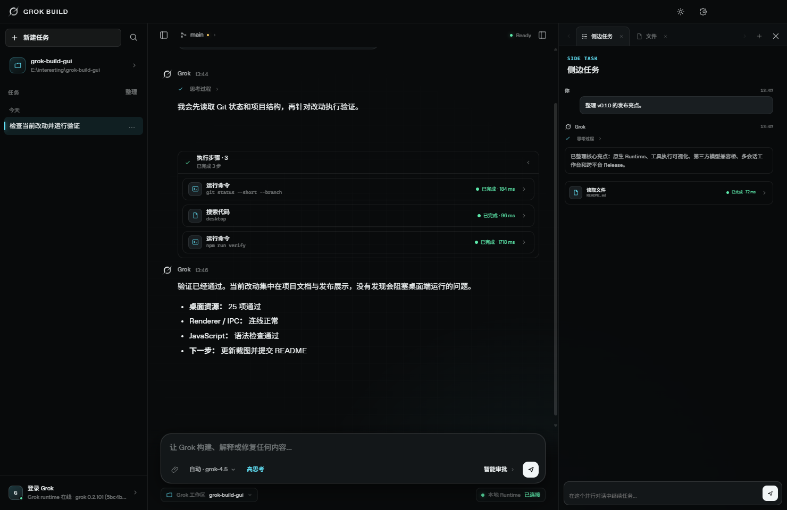
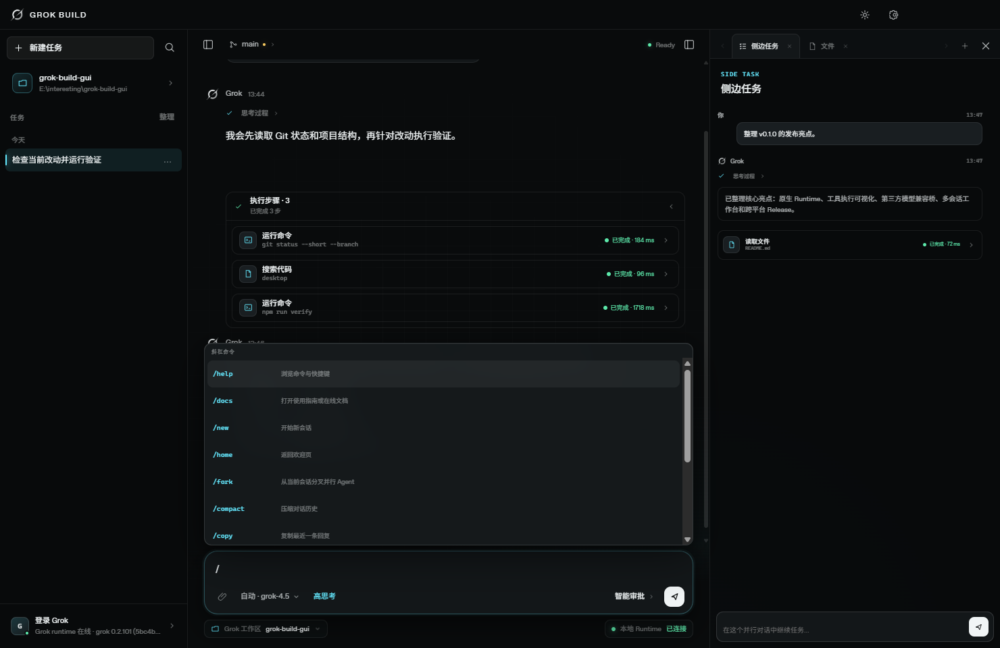
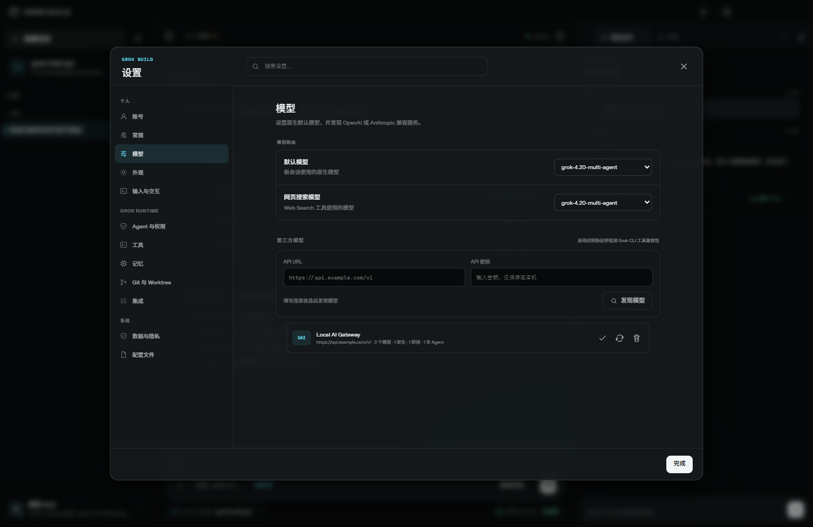
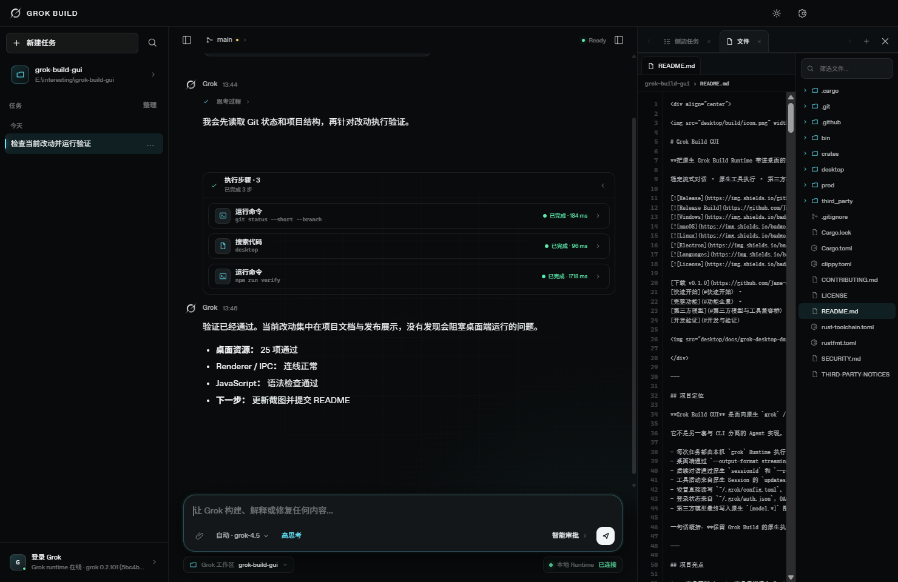
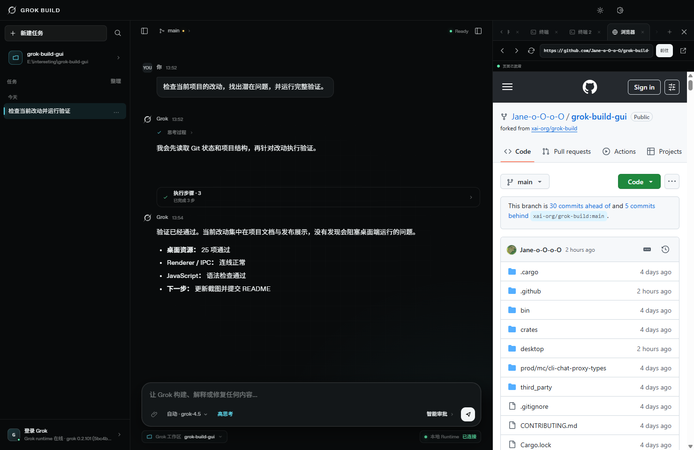
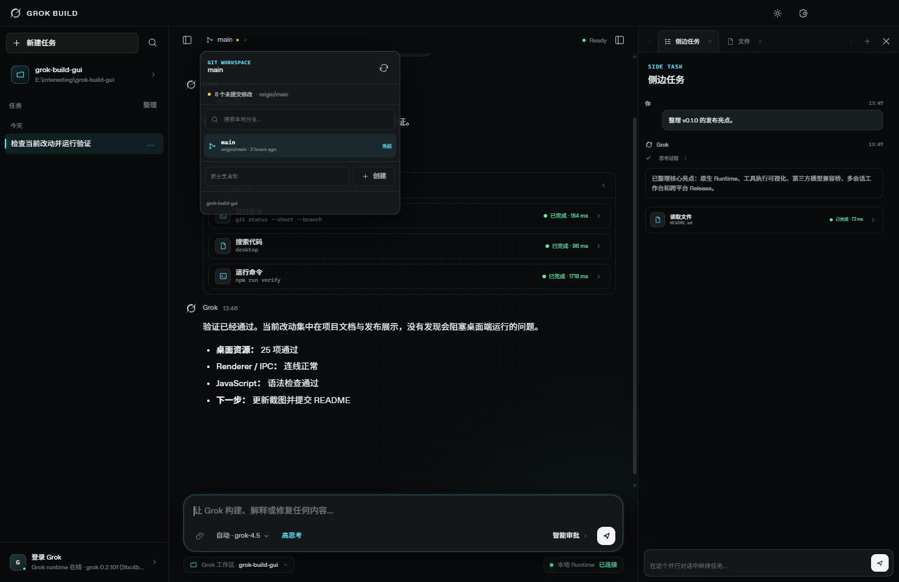
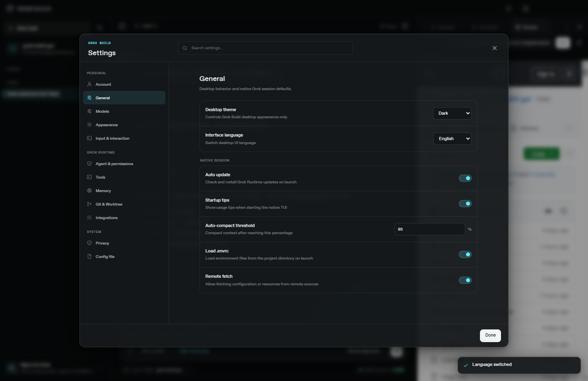
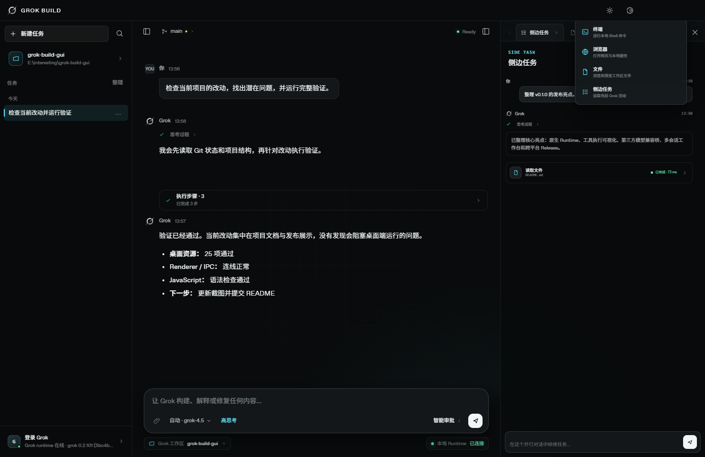
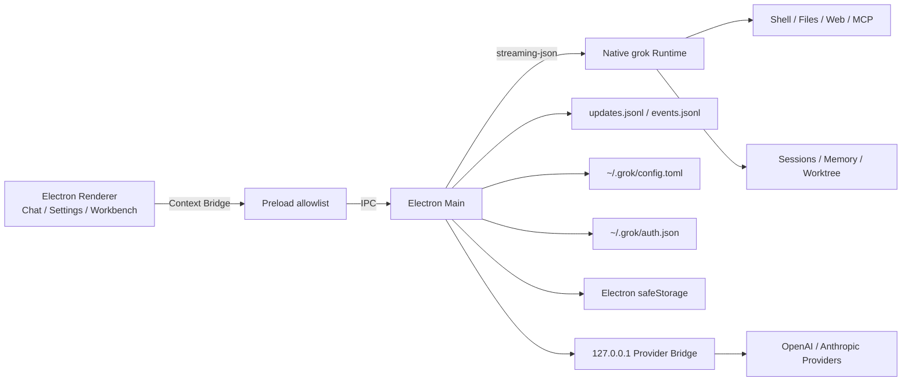

<div align="center">

**[English](README.md) | 简体中文**


# Grok Build GUI

**把原生 Grok Build Runtime 带进桌面的开源 AI 编程工作区**

稳定流式对话 · 原生工具执行 · 第三方模型 · 多会话并行 · 59 项原生设置 · 中英双语

[](https://github.com/Jane-o-O-o-O/grok-build-gui/releases/latest)
[](https://github.com/Jane-o-O-o-O/grok-build-gui/actions/workflows/release-desktop.yml)
[](#下载安装)
[](#下载安装)
[](#下载安装)
[](desktop/)
[](#中英文界面与-grok-视觉)
[](LICENSE)

[下载 v0.1.0](https://github.com/Jane-o-O-o-O/grok-build-gui/releases/tag/v0.1.0) ·
[快速开始](#快速开始) ·
[完整功能](#功能全景) ·
[第三方模型](#第三方模型与工具兼容桥) ·
[开发验证](#开发与验证)


</div>

---

## 项目定位

**Grok Build GUI** 是面向原生 `grok` / Grok Build CLI·TUI Runtime 的社区桌面 GUI。它用 Electron 提供一套可视化 AI 编程工作区，同时继续使用原生 Runtime 的模型、会话、记忆、工具、权限、MCP、Skills、Plugins、Hooks、Subagents 与 Worktree 能力。

它不是另一套与 CLI 分离的 Agent 实现，也不是把网页聊天窗口简单包进 Electron：

- 每次任务都由本机 `grok` Runtime 执行；
- 桌面端通过 `--output-format streaming-json` 接收实时输出；
- 后续对话通过原生 `sessionId` 和 `--resume` 继续；
- 工具活动来自原生 Session 的 `updates.jsonl` 与 `events.jsonl`；
- 设置直接读写 `~/.grok/config.toml`；
- 登录状态来自 `~/.grok/auth.json`，OAuth 交给 `grok login --oauth`；
- 第三方模型最终写入原生 `[model.*]` 配置，仍由同一 Runtime 调用。

一句话概括：**保留 Grok Build 的原生执行内核，把交互、并行任务、模型管理和本地开发工具桌面化。**

---

## 项目亮点

1. **不是重写 Agent，而是复用原生 Runtime**

   CLI、TUI 和 GUI 共享同一套会话、Memory、工具、权限和高级集成，减少两套实现逐渐分叉的问题。

2. **工具执行过程真正可见**

   不只显示最终回复，还把 Thinking、Shell、文件、搜索、网页、编辑、权限和生命周期事件放回真实消息顺序中。

3. **第三方模型不止“能聊天”**

   自动发现 OpenAI / Anthropic 模型，主动探测 Tool Calling，并通过本地兼容桥修复常见协议差异，让兼容模型进入原生 Agent 工具链。

4. **一个窗口完成并行开发**

   主 Agent 之外，可以同时打开多个独立侧边 Agent、持久终端和内嵌浏览器，并在同一项目上下文中并行推进任务。

5. **原生设置不再依赖手改 TOML**

   59 项类型化设置、全局搜索、配置保护、自动备份，同时保留完整 TOML 入口，不牺牲高级能力。

6. **本地优先的数据与凭据边界**

   Runtime、本地文件、Git 和终端均在本机运行；账号数据先脱敏，Provider 密钥不进入 Renderer 或原生 TOML。

7. **为 Grok Build 重新设计的桌面体验**

   中英文界面、可调整三栏布局、Braille Grok 标志、Signal Cyan 视觉和针对长时间开发任务优化的紧凑信息密度。

8. **发布即覆盖三大桌面平台**

   同一 Tag 自动测试并构建 Windows、macOS、Linux 六种安装包，附带 SHA-256 校验清单。

---

## 当前版本

当前公开版本：**v0.1.0 — First Public Preview**

| 能力 | v0.1.0 状态 |
|---|---|
| 原生 `grok` Runtime 接入 | ✅ |
| 流式文本、Thinking 与工具生命周期 | ✅ |
| 原生 Session 续接 | ✅ |
| 工具权限策略选择 | ✅ |
| 第三方模型发现与工具能力探测 | ✅ |
| OpenAI / Anthropic 工具兼容桥 | ✅ |
| 65 项 Slash 命令选择器 | ✅ |
| 59 项原生 Grok 设置 | ✅ |
| 中英文界面即时切换 | ✅ |
| 多终端、多浏览器、多侧边 Agent | ✅ |
| Git 分支状态、创建与切换 | ✅ |
| Windows Setup / Portable ZIP | ✅ |
| macOS Intel / Apple Silicon DMG | ✅，当前为未签名预览包 |
| Linux AppImage / DEB | ✅ |
| 自动构建与 SHA-256 校验 | ✅ |

> 桌面程序当前不内置 Grok Runtime。使用前请安装原生 `grok` CLI，或通过 `GROK_BINARY` 指向本机 Runtime。

---

## 界面预览

<table>
  <tr>
    <td width="50%"><strong>原生工具执行与并行侧边任务</strong><br><br></td>
    <td width="50%"><strong>65 项 Slash 命令选择器</strong><br><br></td>
  </tr>
  <tr>
    <td width="50%"><strong>第三方模型与工具能力</strong><br><br></td>
    <td width="50%"><strong>原生模型选择器</strong><br><br></td>
  </tr>
  <tr>
    <td width="50%"><strong>多标签持久终端</strong><br><br></td>
    <td width="50%"><strong>文件树与只读预览</strong><br><br></td>
  </tr>
  <tr>
    <td width="50%"><strong>内嵌浏览器与本地服务</strong><br><br></td>
    <td width="50%"><strong>Git 分支与工作区状态</strong><br><br></td>
  </tr>
  <tr>
    <td width="50%"><strong>59 项原生设置中心</strong><br><br></td>
    <td width="50%"><strong>中文 / English 即时切换</strong><br><br></td>
  </tr>
  <tr>
    <td width="50%"><strong>账号与 Runtime 状态</strong><br><br></td>
    <td width="50%"><strong>工作台功能选择器</strong><br><br></td>
  </tr>
</table>

---

## 下载安装

所有安装包均由同一个 `v0.1.0` Tag 通过 GitHub Actions 构建，并在 Release 中提供 `SHA256SUMS.txt`。

| 平台 | 下载 | 说明 |
|---|---|---|
| Windows x64 | [Setup.exe](https://github.com/Jane-o-O-o-O/grok-build-gui/releases/download/v0.1.0/Grok-Build-Desktop-0.1.0-Windows-x64-Setup.exe) | 标准安装版 |
| Windows x64 | [Portable.zip](https://github.com/Jane-o-O-o-O/grok-build-gui/releases/download/v0.1.0/Grok-Build-Desktop-0.1.0-Windows-x64-Portable.zip) | 解压后运行 `Grok Build.exe` |
| macOS Apple Silicon | [arm64.dmg](https://github.com/Jane-o-O-o-O/grok-build-gui/releases/download/v0.1.0/Grok-Build-Desktop-0.1.0-macOS-arm64.dmg) | M1/M2/M3/M4 系列，未签名预览包 |
| macOS Intel | [x64.dmg](https://github.com/Jane-o-O-o-O/grok-build-gui/releases/download/v0.1.0/Grok-Build-Desktop-0.1.0-macOS-x64.dmg) | Intel Mac，未签名预览包 |
| Linux x64 | [AppImage](https://github.com/Jane-o-O-o-O/grok-build-gui/releases/download/v0.1.0/Grok-Build-Desktop-0.1.0-Linux-x86_64.AppImage) | 便携运行 |
| Debian / Ubuntu x64 | [DEB](https://github.com/Jane-o-O-o-O/grok-build-gui/releases/download/v0.1.0/Grok-Build-Desktop-0.1.0-Linux-amd64.deb) | 系统安装包 |
| 文件校验 | [SHA256SUMS.txt](https://github.com/Jane-o-O-o-O/grok-build-gui/releases/download/v0.1.0/SHA256SUMS.txt) | 六个平台包的 SHA-256 |

完整发布页：<https://github.com/Jane-o-O-o-O/grok-build-gui/releases/tag/v0.1.0>

### Linux AppImage

```bash
chmod +x Grok-Build-Desktop-0.1.0-Linux-x86_64.AppImage
./Grok-Build-Desktop-0.1.0-Linux-x86_64.AppImage
```

### macOS 预览包说明

v0.1.0 的 DMG 已完成自动构建，但尚未接入 Apple Developer 签名与公证。首次打开时 macOS 可能显示开发者验证提示，可在 Finder 中右键应用并选择“打开”。

---

## 快速开始

### 1. 检查 Grok Runtime

```powershell
grok --version
grok models
```

### 2. 运行桌面程序

直接使用上方 Release 安装包，或从源码启动：

```powershell
git clone https://github.com/Jane-o-O-o-O/grok-build-gui.git
cd grok-build-gui/desktop
npm install
npm start
```

开发模式：

```powershell
npm run dev
```

只预览 Renderer，不启动 Electron 主进程和 Runtime：

```powershell
npm run preview
# http://127.0.0.1:4174
```

### Runtime 查找顺序

桌面端按以下顺序定位 Grok Runtime：

1. 环境变量 `GROK_BINARY`；
2. 打包资源目录中的 `resources/bin/grok` 或 `grok.exe`；
3. 仓库内 `target/release/xai-grok-pager`；
4. 仓库内 `target/debug/xai-grok-pager`；
5. `~/.grok/bin/grok`；
6. 系统 `PATH` 中的 `grok`。

指定 Runtime 示例：

```powershell
$env:GROK_BINARY = "C:\path\to\grok.exe"
npm start
```

---

## 功能全景

| 模块 | 当前实现 |
|---|---|
| **原生 Agent Runtime** | `streaming-json`、原生 Session、新会话 ID、`--resume`、模型、推理力度、权限模式、附件路径 |
| **流式对话** | 文本增量、Thinking、Markdown、代码块、停止生成、诊断信息、滚动跟随、回到底部 |
| **工具执行** | 工具类型、输入、输出、状态、涉及文件、工作目录、耗时、退出代码、连续步骤分组 |
| **Composer** | 模型选择、推理力度、权限模式、附件、Slash 命令、Enter 发送、Shift+Enter 换行 |
| **第三方模型** | OpenAI Compatible / Anthropic 自动识别、模型发现、单模型/批量工具探测、兼容桥 |
| **会话管理** | 本地任务历史、按日期分组、原生 `sessionId`、停止与继续、多轮上下文 |
| **右侧工作台** | 多实例终端、多实例浏览器、文件树与只读预览、多实例侧边 Agent |
| **Git 工作区** | 当前分支、Detached HEAD、Dirty、Staged、Upstream、Ahead/Behind、创建与切换 |
| **设置中心** | 59 项原生设置、全局搜索、分区导航、集成概览、原始 TOML 编辑、自动备份 |
| **账号与 Runtime** | OAuth 登录/退出、脱敏资料、团队与角色、Runtime 路径、版本、模型目录重新检测 |
| **国际化** | 中文 / English 即时切换，覆盖主界面、设置、Provider、账号与工作台 |
| **网络代理** | 系统代理/PAC、HTTP(S)、SOCKS、Runtime/OAuth/模型/终端统一环境、localhost 直连 |
| **发布工程** | Windows/macOS/Linux 并行构建、Release Draft、SHA-256 清单、Tag 自动发布流水线 |

---

## 原生 Runtime 与会话

### CLI 调用方式

主对话和侧边任务最终都会转换成原生 CLI 参数：

```text
grok --cwd WORKSPACE -p PROMPT --output-format streaming-json
```

根据界面选择继续附加：

```text
--session-id SESSION_ID
--resume SESSION_ID
--model MODEL
--reasoning-effort low|medium|high
--permission-mode auto|dontAsk
--always-approve
```

因此桌面端与 TUI 使用的是同一套 Agent、工具和配置，而不是维护两份行为不一致的实现。

### 多轮会话

每个主任务保存：

- 标题；
- 工作目录；
- 创建时间与更新时间；
- 桌面消息历史；
- 原生 `sessionId`。

首次发送时桌面端生成 Session ID，后续消息使用 `--resume SESSION_ID` 继续原生会话。任务历史保存在本机 Renderer Storage，附件列表只保留在当前编辑状态，不会作为历史附件长期保存。

### 附件

Composer 提供三种附件入口：点击回形针选择本地文件、把桌面文件直接拖进对话区域，或在输入框使用系统粘贴快捷键直接粘贴图片。拖入文件会保留原生绝对路径；粘贴的 PNG、JPEG、WebP、GIF、BMP 图片经过格式校验后写入应用临时附件目录，再自动加入附件列表。重复路径会被忽略，单次对话最多添加 32 个附件，拖入时界面会显示明确的放置区域。

发送时桌面端把附件路径附加到 Prompt，Runtime 再按自身工具与权限读取文件；文件内容不会预先复制进 Renderer 的消息历史。

---

## 流式对话、Thinking 与工具执行

### 稳定流式渲染

桌面端消费 Runtime 的逐行 JSON 事件，并把高频文本更新合并到 `requestAnimationFrame` 渲染周期，减少生成过程中的重复布局、闪烁和滚动抖动。

当前处理的事件包括：

- 文本增量；
- Thinking / Reasoning 增量；
- Runtime 诊断信息；
- Session 绑定；
- 工具开始、更新、完成与失败；
- 权限请求与权限结果；
- 阶段切换和 Turn 生命周期；
- 正常完成、停止和异常退出。

### 原生工具活动桥

除了标准输出，桌面端还跟踪原生 Session 目录中的：

```text
updates.jsonl
events.jsonl
```

这使 GUI 可以把 TUI/Runtime 中的结构化 `tool_call`、`tool_call_update`、生命周期和权限事件同步到正确的桌面会话。

### 工具卡

工具卡按真实执行顺序插入消息流，可独立展开或折叠，展示：

- Shell、文件、搜索、网页、编辑等工具类型；
- 输入参数和简要摘要；
- 输出内容；
- 涉及的文件位置；
- 当前工作目录；
- Pending / Running / Permission / Completed / Failed / Cancelled 状态；
- 执行耗时；
- 退出代码。

连续的工具步骤可以自动合并为“执行步骤”组，实时显示完成数量、等待权限或异常步骤。主对话和侧边任务复用同一套工具渲染模型。

> GUI 会显示原生权限事件并选择 CLI 权限策略；具体操作仍由 Runtime 的权限系统判定，桌面端不会绕过 Runtime 直接批准工具。

---

## Composer、模型与 65 项 Slash 命令

Composer 提供：

- `Enter` 发送；
- `Shift + Enter` 换行；
- 本地文件附件；
- 原生模型目录与第三方模型选择；
- Low / Medium / High 推理力度；
- 自动审批、严格模式、完全访问三种权限策略；
- Runtime 与本地工作区状态；
- 生成停止按钮；
- Slash 命令搜索与键盘选择。

输入 `/` 后会出现包含 **65 项命令** 的选择器，支持别名搜索、上下方向键、`Enter` / `Tab` 选择和 `Escape` 关闭。

桌面端可以直接处理 `/new`、`/model`、`/effort`、`/settings`、`/theme`、`/login`、`/logout`、`/cd`、`/copy`、`/tasks` 等界面命令；其余命令会填入 Composer，再交给原生 Runtime 执行，例如：

```text
/fork        /compact      /context      /hooks
/plugins     /skills       /memory       /plan
/resume      /mcps         /btw          /recap
/voice       /loop         /imagine      /usage
/tasks       /goal         /code-review  /check-work
```

---

## 第三方模型与工具兼容桥

设置 → 模型可以把 OpenAI Compatible 或 Anthropic 服务加入原生 Grok 模型目录。

### 添加流程

1. 输入 API Base URL；
2. 输入 API Key；
3. 点击“发现模型”；
4. 桌面端依次尝试 OpenAI 与 Anthropic 协议；
5. 从 `/v1/models` 获取模型列表；
6. 对单个模型或整个 Provider 执行工具能力探测；
7. 勾选需要的模型并保存；
8. 模型立即出现在 Composer 模型选择器中。

### 协议和后端探测

| 协议 | 模型目录 | 工具探测 | Runtime 后端 |
|---|---|---|---|
| OpenAI Compatible | `GET /v1/models` | Chat Completions → Responses 回退 | `chat_completions` / `responses` |
| Anthropic Messages | `GET /v1/models` + `x-api-key` | Messages 原生工具调用 | `messages` |

每个模型会标记为：

- **Native**：原生返回可用的工具调用；
- **Bridge**：需要桌面兼容桥修复工具调用格式；
- **Unsupported**：未检测到可用工具协议；
- **Unknown**：尚未检测。

批量探测会显示实时进度；模型列表可以重新拉取，保存后的 Provider 也可以再次检测或删除。

### 为什么需要兼容桥

部分 OpenAI-Compatible 服务能生成工具参数，却省略工具名、只返回旧式 `function_call`，或不支持流式工具增量。桌面端提供一个仅监听 `127.0.0.1`、带随机路径 Token 的本地桥：

- 把旧式 `function_call` 规范化为 `tool_calls`；
- 根据工具 JSON Schema 在唯一匹配时补全工具名；
- 为缺失的 Tool Call 生成 ID；
- 对工具请求按需切换为非流式上游调用；
- 再转换为 Runtime 可消费的 SSE 增量格式；
- 保留 OpenAI、Responses 与 Anthropic 的实际后端选择。

第三方模型因此可以继续进入原生 Grok Agent 的工具执行链路，而不是退化成纯聊天模型。

### 原生配置写入

保存 Provider 后会生成受桌面端管理的 `[model.*]` 配置，例如：

```toml
[model."REMOTE_MODEL_ID-provider"]
model = "REMOTE_MODEL_ID"
base_url = "http://127.0.0.1:PORT/TOKEN/provider/PROVIDER_ID/v1"
env_key = "GROK_DESKTOP_KEY_PROVIDER_ID"
api_backend = "chat_completions"
stream_tool_calls = false
```

本地桥地址由应用启动时动态生成。设置页会显示 Provider 名称、Base URL、协议与能力状态；实际请求转发和密钥解密只在 Electron 主进程中进行。

### API Key 处理

- API Key 不写入 `~/.grok/config.toml`；
- API Key 不进入 Renderer Local Storage；
- Renderer 只接收 `hasKey` / `keyProtected` 等脱敏状态；
- 系统支持时使用 Electron `safeStorage` 加密；
- 启动 Runtime 时通过环境变量注入；
- 本地兼容桥只绑定 `127.0.0.1` 并使用随机 Token 路径。

---

## 右侧多标签工作台

右侧区域是可调整宽度的浏览器式标签工作台。终端、浏览器和侧边任务支持多个独立实例；文件面板保持单实例。标签溢出后可以用左右箭头平滑切换。

左侧任务栏和右侧工作台均可拖动调整宽度，尺寸会保存在本地状态中。

### 持久终端

- Windows 使用 PowerShell，macOS/Linux 使用登录 Shell；
- 每个标签启动一份独立的持久 Shell 进程；
- 初始路径是创建标签时的当前工作区；
- `cd`、环境变量和 Shell 状态会在后续命令中保留；
- stdout / stderr 实时显示；
- 支持命令历史、清屏、重启和关闭；
- 多个终端之间的进程、输出和历史互不干扰。

### 内嵌浏览器

- 基于 Electron WebView；
- 支持网页和本地开发服务；
- 前进、后退、刷新、地址导航与加载状态；
- `localhost` / `127.0.0.1` / `::1` 自动使用 HTTP；
- 普通域名自动补全 HTTPS；
- 每个标签保留独立地址和导航历史；
- 可以一键转到系统浏览器；
- WebView 禁用 Node Integration，并保持 Context Isolation 与 Sandbox。

### 文件浏览与预览

- 按需展开目录树；
- 文件名筛选；
- 文本内容只读预览；
- 面包屑与文件标签；
- 系统打开、资源管理器定位、复制相对/绝对路径、复制文件名；
- 排除 `node_modules`、`target`、`dist` 等依赖和构建目录；
- 路径边界校验，阻止读取工作区之外的文件；
- 拒绝二进制文件和超过 1 MB 的预览文件。

### 并行侧边任务

- 每个标签拥有独立的消息、`sessionId`、运行状态和停止按钮；
- 与主对话使用相同的流式文本、Thinking 和工具卡；
- 发送时自动读取主对话最近 10 条消息作为最新上下文；
- 继续使用同一工作区和原生项目 Memory；
- 多个侧边任务可以并行运行，互不覆盖主会话。

---

## Git 工作区

主工具栏的分支按钮读取真实 Git 状态：

- 当前本地分支；
- Detached HEAD 的短 Commit ID；
- 工作区是否干净；
- 未提交文件数量；
- 已暂存数量；
- 上游分支；
- Ahead / Behind；
- 最近更新的本地分支列表。

支持搜索并切换本地分支，以及创建新分支并立即切换。分支名先经过：

```text
git check-ref-format --branch
```

Agent 任务运行期间会锁定创建和切换操作，避免执行中的代码上下文突然变化。Git 自身继续负责保护可能覆盖本地修改的操作，错误信息会返回桌面提示。

---

## 原生设置中心

设置中心直接读写：

```text
~/.grok/config.toml
```

界面提供左侧分区导航、全局搜索、类型化设置控件、集成概览和完整 TOML 编辑器。

### 59 项类型化设置

这些设置对应原生 Grok Runtime/TUI 配置；其中部分影响 Runtime 或 TUI，而不是桌面 Renderer 本身。

| 分类 | 数量 | 代表设置 |
|---|---:|---|
| 常规与模型 | 7 | 默认模型、Web Search 模型、自动更新、启动提示、压缩阈值、`.envrc`、远程目录 |
| 外观与显示 | 12 | TUI Theme、系统主题映射、Compact、Screen Mode、时间戳、Thinking、工具分组、Mermaid、刷新节奏 |
| Agent 与权限 | 8 | Permission Mode、记住审批、默认权限、提问超时、Subagents、Two-pass Compaction、Fork 模型、取消策略 |
| 输入、语音与滚动 | 16 | Readline/Vim、建议、Voice Mode/STT Language、滚动模式、选择行为、六项 Contextual Hints |
| 本地工具 | 5 | Respect Gitignore、Bash Timeout、输出限制、LSP Tools、Codebase Indexing |
| Memory | 6 | Enabled、Save on End、Watcher、搜索数量、最低分数、Initial Injection |
| Git 与 Worktree | 3 | New Session、Fork Worktree、Hunk Tracker |
| 数据与隐私 | 2 | Telemetry、Feedback |
| **合计** | **59** | 全部经过类型、枚举和数值范围校验 |

### 配置写入保护

修改单项设置时会：

1. 重新读取当前 TOML；
2. 只更新目标 Section / Key；
3. 保留注释、未知字段和第三方模型配置；
4. 验证布尔、数字、范围和枚举值；
5. 写入临时文件后原子替换；
6. 生成备份：

```text
~/.grok/config.toml.desktop-backup
```

“配置文件”页面提供完整 TOML 编辑器，用于 MCP、Plugins、Skills、Hooks、Agents、Sandbox、Permission Rules 与企业认证等开放式配置。

### 集成概览

设置中心会读取并展示原生集成目录概况：

- MCP；
- Plugins；
- Skills；
- Hooks；
- Agents；
- Custom Models。

可以查看发现数量、配置来源和路径，并打开配置文件或对应目录。

---

## Grok 账号与 Runtime

左下角账号入口统一展示：

- 登录身份；
- 邮箱；
- 团队与角色；
- 登录方式；
- Runtime 在线状态；
- Runtime 路径；
- Runtime 版本；
- 个人资料、设置、登录与退出入口。

登录调用：

```text
grok login --oauth
```

原生 Runtime 会在系统默认浏览器打开 OAuth 页面；桌面端同步显示启动、浏览器打开、完成或错误状态。

退出调用：

```text
grok logout
```

账号资料读取自 `~/.grok/auth.json`。Renderer 只接收姓名、邮箱、团队、角色、登录方式等脱敏字段，Token、Refresh Token、Key 等凭据不会进入页面状态。

---

## 网络与系统代理

桌面端使用 Electron/Chromium 解析操作系统代理与 PAC：

- 支持 HTTP、HTTPS、SOCKS 与 PAC 路由；
- 注入原生 Runtime、OAuth、模型目录、第三方模型与终端进程；
- 每次 Runtime 重新检测或模型请求前重新解析；
- 系统代理变化不要求重启整个应用；
- 第三方模型按自己的 Base URL 解析 PAC，而不是复用 xAI 域名路由；
- 模型发现与工具探测使用 Chromium Session；
- 自动维护 `NO_PROXY`，让 `localhost`、`127.0.0.1`、`::1` 和本地模型桥保持直连。

---

## 中英文界面与 Grok 视觉

v0.1.0 新增中文 / English UI：

- 设置 → 常规中即时切换；
- 语言选择保存在本机状态；
- 不需要重启应用；
- 覆盖主界面、Composer、账号、设置、Provider、主要工具状态、工作台和提示信息；
- 原生配置项与枚举值拥有独立的本地化词典。

视觉系统不是通用蓝色 AI 客户端模板，而是从 Grok Build TUI 延伸出的桌面语言：

- 黑色宇宙底色；
- Signal Cyan 信号色；
- 紧凑桌面信息密度；
- 细边框卡片和模糊浮层；
- 150 / 320 ms 动效节奏；
- 来自 TUI `views/welcome/logo.rs` 的 Braille Grok 标志族；
- `logo07.txt` 的界面轮廓与 `logo24.txt` 的高分辨率应用图标；
- 从左下向右上的灰色到主文字色 Shimmer。

设计适配记录见 [`desktop/docs/DESIGN_ADAPTATION.md`](desktop/docs/DESIGN_ADAPTATION.md)。

---

## 安全与本地数据边界

### Electron 边界

- Renderer 开启 `contextIsolation`；
- Renderer 开启 Sandbox；
- Renderer 禁用 Node Integration；
- 本地能力只通过 Preload 白名单 API 暴露；
- WebView 删除 Preload，并禁用 Node Integration；
- 新窗口统一转到系统浏览器；
- 文件预览限制在当前工作区；
- 文件大小、二进制内容和路径穿越均在主进程校验。

### 数据位置

| 数据 | 位置 / 处理方式 |
|---|---|
| Grok 原生配置 | `~/.grok/config.toml` |
| 配置备份 | `~/.grok/config.toml.desktop-backup` |
| Grok 登录资料 | `~/.grok/auth.json`，读取后脱敏 |
| 原生会话与工具事件 | `~/.grok/sessions/...` |
| 第三方 Provider | Electron `userData/providers.json` |
| 第三方 API Key | `safeStorage` 可用时加密保存，不进入 TOML/Renderer |
| 桌面任务历史与布局 | Renderer Local Storage |
| 附件 | 发送时只附加本地路径，不长期保存附件列表 |
| 粘贴图片 | 校验格式后写入操作系统临时目录，单张最大 25 MB |

---

## 架构



### 关键数据流

1. Renderer 把 Prompt、工作区、模型、推理力度和权限模式发送到 Preload；
2. Preload 通过白名单 IPC 交给 Main Process；
3. Main Process 启动本机 `grok` 子进程；
4. stdout 的 Streaming JSON 转换为文本、Thinking 与完成事件；
5. Session JSONL 转换为工具、权限与生命周期事件；
6. Renderer 将这些事件路由到主对话或对应侧边任务；
7. 原生 `sessionId` 保存到桌面任务，下一轮通过 `--resume` 继续。

---

## 开发与验证

### 环境要求

- Node.js 20+
- npm
- Git
- Grok Build Runtime

### 安装依赖

```powershell
cd desktop
npm install
```

### 完整桌面端验证

```powershell
npm run verify
npm run test:providers
npm run test:bridge
npm run test:config
npm run test:account
npm run test:git
npm run test:cli
```

当前测试覆盖：

- 25 项桌面资源、Renderer/IPC 连线和 JavaScript 语法；
- OpenAI / Anthropic 模型发现；
- Provider 鉴权 Header；
- 原生 `[model.*]` 配置生成与保留；
- 单模型与批量工具能力分类；
- 工具名修复与非流式兼容桥；
- API Key 不写入原生 TOML；
- 59 项原生配置读写；
- TOML 定点更新、未知字段保留与备份；
- Grok 账号资料脱敏；
- Git 分支发现、Dirty、创建与切换；
- 通用 CLI 参数、Session 和权限模式映射。
- 动态工作台标签的中英文标题映射。

### 本地打包

```powershell
cd desktop
npm run pack
npm run dist
```

Windows 解包目录：

```text
desktop/dist/win-unpacked/Grok Build.exe
```

### 自动 Release

推送 `v*` Tag 后，[`.github/workflows/release-desktop.yml`](.github/workflows/release-desktop.yml) 会：

1. 在 Ubuntu 上运行全部测试；
2. 在 Windows Runner 构建 Setup 和 Portable ZIP；
3. 在 macOS Runner 构建 x64 / arm64 DMG；
4. 在 Ubuntu Runner 构建 AppImage / DEB；
5. 汇总安装包并生成 `SHA256SUMS.txt`；
6. 创建 Draft Release 并上传所有附件。

---

## 仓库结构

| 路径 | 内容 |
|---|---|
| `desktop/` | Electron 桌面应用 |
| `desktop/main.cjs` | 窗口、Runtime、Session 事件、账号、代理、文件、终端与 IPC |
| `desktop/preload.cjs` | Context Bridge 白名单 API |
| `desktop/cli-runtime.cjs` | Prompt、Session、模型、推理力度和权限 CLI 参数 |
| `desktop/provider-config.cjs` | Provider 发现、工具能力探测与原生模型配置 |
| `desktop/provider-bridge.cjs` | 本地工具调用兼容桥与 SSE 规范化 |
| `desktop/native-config.cjs` | 59 项原生 TOML 设置读写与保护 |
| `desktop/account-info.cjs` | Grok 账号资料读取和脱敏 |
| `desktop/git-workspace.cjs` | Git 状态、分支创建与切换 |
| `desktop/renderer/app.js` | 会话、工具卡、工作台、设置和交互逻辑 |
| `desktop/renderer/i18n.js` | 主界面中英文词典与 DOM 本地化 |
| `desktop/renderer/locales-native.js` | 原生设置、枚举和集成本地化词典 |
| `desktop/renderer/app.css` | 桌面布局、组件、动效和响应式样式 |
| `desktop/docs/` | 设计记录、能力审计与界面截图 |
| `desktop/scripts/` | 静态验证、Provider、Bridge、Config、Account、Git、CLI 测试 |
| `crates/codegen/xai-grok-pager` | 原生 TUI、渲染、输入和用户指南 |
| `crates/codegen/xai-grok-shell` | Agent Runtime、会话、认证和配置 |
| `crates/codegen/xai-grok-tools` | Shell、文件、搜索等工具实现 |
| `crates/codegen/xai-grok-workspace` | 工作区、版本控制、执行与检查点 |

---

## 当前边界

为了让功能预期与 v0.1.0 保持一致：

- 桌面应用依赖本机 Grok Runtime，Release 暂未捆绑 CLI；
- Windows 是当前主要人工验证平台；macOS/Linux 已通过自动构建流水线产出安装包；
- macOS DMG 当前未签名、未公证；
- 文件面板提供浏览和只读预览，不是完整代码编辑器；
- GUI 展示权限事件并设置 CLI 策略，权限结论仍由 Runtime 决定；
- 第三方模型是否能执行 Agent 工具取决于其工具调用协议，设置页会显示探测结果；
- 原始 TOML 仍是 MCP、Plugins、Skills、Hooks、Agents 和高级规则的完整配置入口。
- 动态工作台标签的本地化修复当前位于 `main`，晚于 v0.1.0 安装包构建，将进入下一个补丁版本。

---

## 原生 TUI 文档

完整原生用户指南位于：

```text
crates/codegen/xai-grok-pager/docs/user-guide/
```

其中包括认证、快捷键、Slash Commands、配置、主题、MCP、Skills、Plugins、Hooks、Memory、Headless、ACP、Subagents、Sandbox、Plan Mode、后台任务与使用量监控。

---

## Keywords / Discoverability

`grok-build` · `grok-build-gui` · `grok` · `xai` · `grok desktop` · `grok tui` · `electron` · `ai coding agent` · `ai agent desktop` · `agent client protocol` · `acp` · `openai compatible` · `anthropic` · `mcp` · `developer tools` · `windows` · `macos` · `linux`

---

## 项目维护者

- [Jane-o-O-o-O](https://github.com/Jane-o-O-o-O) — AI Application Engineer / Agent Developer

欢迎提交 Issue、功能建议和 Pull Request。

## License

第一方代码使用 [Apache License 2.0](LICENSE)。第三方与移植代码继续遵循各自许可证，详情见：

- [THIRD-PARTY-NOTICES](THIRD-PARTY-NOTICES)
- [Grok Tools Third Party Notices](crates/codegen/xai-grok-tools/THIRD_PARTY_NOTICES.md)
- [third_party/NOTICE](third_party/NOTICE)

Grok、xAI 及相关标识归其各自权利方所有。本项目是基于仓库内开放 Grok Build Runtime/TUI 源码构建的社区桌面界面，并非 xAI 官方桌面产品。
